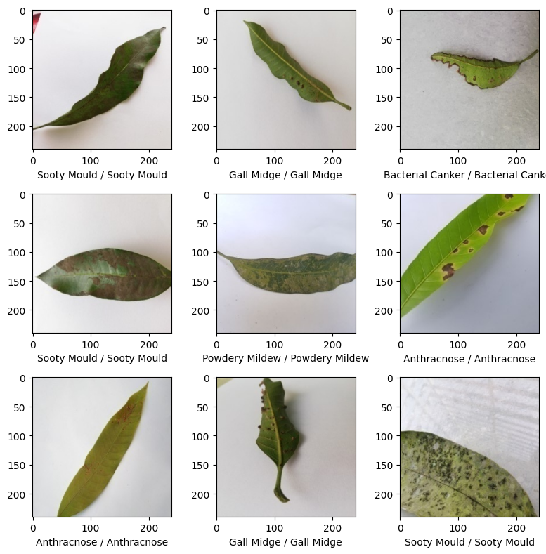

# Modified-DenseNet-Convolution-Network-For-Leave-Disease-Detection-in-Mango-Leave

## Overview
The Modified DenseNet Convolution Network project introduces a novel, state-of-the-art algorithm designed to detect various diseases in mango plants by analyzing leaf images. Leveraging the DenseNet architecture and enhanced features from the MONAI library, this model achieves an impressive accuracy of 97.8%. This project provides a powerful tool for farmers and agricultural researchers to quickly and accurately diagnose plant health issues, promoting better crop management and yield.

## Key Features
1. DenseNet Architecture: Utilizes the DenseNet convolutional neural network architecture for deep feature extraction and efficient learning.
2. MONAI Integration: Incorporates advanced features from the MONAI library, to enhance disease detection capabilities in plant leaves.
3. High Accuracy: Achieves a remarkable accuracy rate of 97.8% in detecting various mango plant diseases, validated through extensive testing.
4. Disease Detection: Identifies multiple types of diseases affecting mango plants based on detailed analysis of leaf images.
5. User-friendly Interface: Provides an easy-to-use interface for uploading leaf images and obtaining diagnostic results quickly.

## Output

